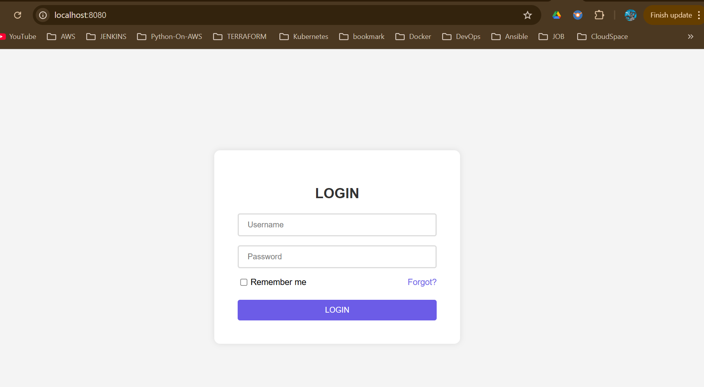

# Deploying-CryptoApp-to-AWSEKS-Using-AWSCodePipeline
Deploying a Crypto App to AWS EKS Using AWS CodePipeline, Docker, Terraform, Amazon ECR &amp; S3 Artifact

# PROJECT OVERVIEW
In this project, we will deploy a `Flask-based Crypto Application` using a fully automated CI/CD pipeline on `AWS EKS`. The application is written in Python and features a basic login page. Upon successful login, the user is redirected to a product page where they can purchase crypto tokens and crypto-based products.


## `Step 1:` Writing the Dockerfile for Local Testing

Before jumping into the deployment pipeline, it is important to containerize the application and test it locally. Below is the Dockerfile that we use to build the Flask app.
### Dockerfile

```
# Use an official Python runtime as a parent image
FROM public.ecr.aws/docker/library/python:3.11-bullseye

# Set the working directory in the container
WORKDIR /usr/src/app

# Copy the current directory contents into the container at /usr/src/app
COPY . .

# Install any needed packages specified in requirements.txt
RUN pip install --no-cache-dir -r requirements.txt

# Make port 5000 available to the world outside this container
EXPOSE 5000

# Define environment variable
ENV FLASK_APP=app.py
ENV FLASK_RUN_HOST=0.0.0.0

# Run flask application
CMD ["flask", "run"]

```

## `Step 2:` Build and Run the Application Locally with Docker

Open your terminal, navigate to the root directory of your project, and run the following commands:
### Build the Docker Image
```
docker build -t crypto-app .
```
### Run the Docker Container
```
docker run -d --name crypto-app -p 8080:5000 crypto-app
```
### Verify Application Locally by opening your browser and navigate to the link bellow. You should see the login page of the crypto application.
```
http://localhost:8080/
```



### Write a playbook with four (4) plays:
* Play1: Deploy apache on ubuntu clients
* Play2: Deploy apache on amazon clients
* Play3: Deploy git on amazon linux clients
* Play4: Deploy git on ubuntu clients

# STEPS BY STEPS PROCESS 

### 1. Launched 3 amazon linux 2 and 2 ubuntu server:


### 2. Installed ansible on linux-ansible-controller:


### 3. Verified ansible is installed in linux-ansible-controller. And generated ssh key-pair. Copied the public key to all 4 nodes:


### 4. Updated “hosts” file in ansible-controller.


### 5. Test the connectivity in-between the controller and nodes:


### 6. Run ansible-hw-playbook.yml file


### 7. Connect to linux-node1 i.e. “ansible-linux-node1” and verify that index.html file is written in /var/www/html


### 8. Connect to ubuntu-node1 i.e. “ansible-node1” and verify that index.html file is written in /var/www/html


### 9. Verify GIT is installed in both linux and ubuntu nodes:


## Author
FOKOUE THOMAS